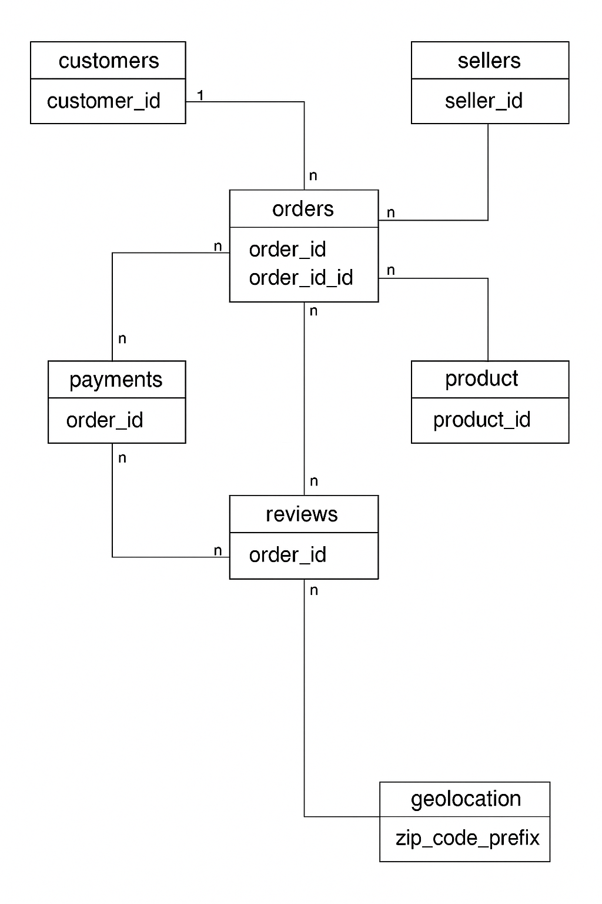

# 📊 E-Commerce Funnel & Revenue Analysis with SQL (BigQuery)

## 🔥 Problem Statement
An e-commerce company wants to improve revenue, understand customer behavior, optimize conversion funnels, and measure marketing experiment impacts using SQL-based data analysis.

## 📂 Dataset Description
- Source: Olist Brazilian E-commerce Dataset ([Kaggle](https://www.kaggle.com/datasets/olistbr/brazilian-ecommerce))
- Tables:
  - Customers
  - Orders
  - Order_Items
  - Payments
  - Reviews
  - Sellers
  - Products
  - Geolocation

## 🔗 ERD Diagram


## 🛠️ Tools Used
- Google BigQuery
- SQL (Advanced)
- Google Cloud Platform
- GitHub for version control

## Data Cleaning Process
- Check basic record counts per table:

``` SELECT COUNT(*) AS total_records FROM ecommerce_olist.olist_orders; 
SELECT COUNT(*) AS total_records FROM ecommerce_olist.olist_customers;
SELECT COUNT(*) AS total_records FROM ecommerce_olist.olist_order_items; 
SELECT COUNT(*) AS total_records FROM ecommerce_olist.olist_order_payments;
SELECT COUNT(*) AS total_records FROM ecommerce_olist.olist_products;
SELECT COUNT(*) AS total_records FR0O0\?/ OM ecommerce_olist.olist_sellers;
```
- Results
```
Total  records from Order items = 112650

Total records from Orders =  96461

Total records from Customers =  99441

Total records from Payments =  103886

Total records from Products =  32341

Total records from Sellers =  3095

Total records from Reviews =  99441
```

 ## Step 2: Null & Missing Value Check (Table by Table)
- Customers Table:
```
SELECT 
  COUNTIF(customer_id IS NULL) AS missing_customer_id,
  COUNTIF(customer_unique_id IS NULL) AS missing_customer_unique_id,
  COUNTIF(customer_city IS NULL) AS missing_city,
  COUNTIF(customer_state IS NULL) AS missing_state
FROM ecommerce_olist.olist_customers;
```
- Orders Table
```
SELECT 
  COUNTIF(customer_id IS NULL) AS missing_customer_id,
  COUNTIF(order_purchase_timestamp IS NULL) AS missing_order_date,
  COUNTIF(order_delivered_customer_date IS NULL) AS missing_delivery_date
FROM ecommerce_olist.olist_orders;
```
- Payments Table 
```
SELECT 
  COUNTIF(order_id IS NULL) AS missing_order_id,
  COUNTIF(payment_value IS NULL) AS missing_payment
FROM ecommerce_olist.olist_order_payments;
```

