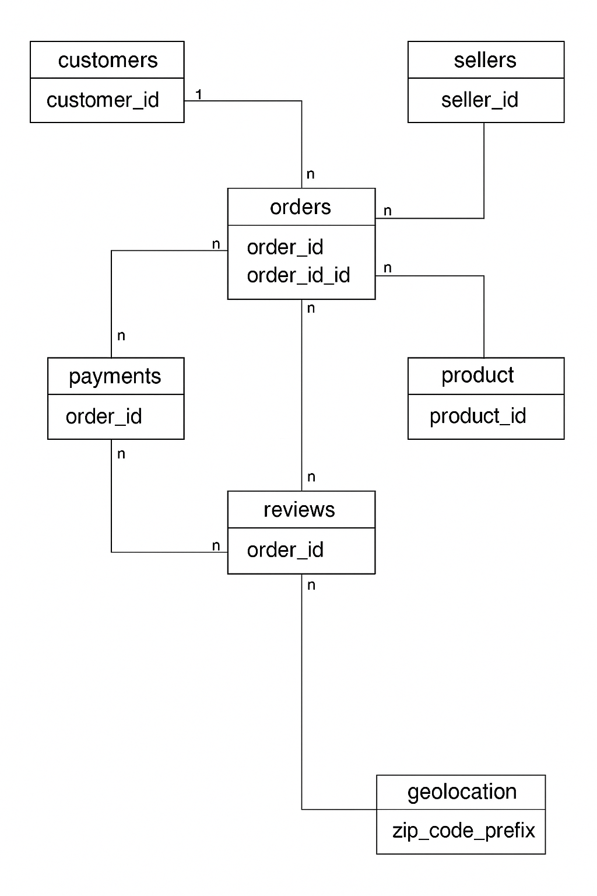

# 📊 E-Commerce Funnel & Revenue Analysis with SQL (BigQuery)

## 🔥 Problem Statement
An e-commerce company wants to improve revenue, understand customer behavior, optimize conversion funnels, and measure marketing experiment impacts using SQL-based data analysis.

## 📂 Dataset Description
- Source: Olist Brazilian E-commerce Dataset ([Kaggle](https://www.kaggle.com/datasets/olistbr/brazilian-ecommerce))
- Tables:
  - Customers
  - Orders
  - Order_Items
  - Payments
  - Reviews
  - Sellers
  - Products
  - Geolocation

## 🔗 ERD Diagram


## 🛠️ Tools Used
- Google BigQuery
- SQL (Advanced)
- Google Cloud Platform
- GitHub for version control

## Data Cleaning Process
- Check basic record counts per table:

``` SELECT COUNT(*) AS total_records FROM ecommerce_olist.olist_orders; 
SELECT COUNT(*) AS total_records FROM ecommerce_olist.olist_customers;
SELECT COUNT(*) AS total_records FROM ecommerce_olist.olist_order_items; 
SELECT COUNT(*) AS total_records FROM ecommerce_olist.olist_order_payments;
SELECT COUNT(*) AS total_records FROM ecommerce_olist.olist_products;
SELECT COUNT(*) AS total_records FR0O0\?/ OM ecommerce_olist.olist_sellers;
```
- Results
```
Total  records from Order items = 112650

Total records from Orders =  96461

Total records from Customers =  99441

Total records from Payments =  103886

Total records from Products =  32341

Total records from Sellers =  3095

Total records from Reviews =  99441
```

 #### Step 2: Null & Missing Value Check (Table by Table)
- Customers Table:
```
SELECT 
  COUNTIF(customer_id IS NULL) AS missing_customer_id,
  COUNTIF(customer_unique_id IS NULL) AS missing_customer_unique_id,
  COUNTIF(customer_city IS NULL) AS missing_city,
  COUNTIF(customer_state IS NULL) AS missing_state
FROM ecommerce_olist.olist_customers;
```
- I did this step for all tables, no issue was found

#### Step 3: Detect Duplicates
- Check for duplicate order_id:
```
SELECT 
  order_id, 
  COUNT(*) AS count
FROM ecommerce_olist.olist_orders
GROUP BY order_id
HAVING COUNT(*) > 1;
```
- I did this step for all tables, no issue was found

#### Step 4: Filter Out Canceled / Unavailable Orders

- Removed 'canceled' and 'unavailable' orders
```
CREATE OR REPLACE VIEW ecommerce_olist.vw_clean_orders AS
SELECT * 
FROM ecommerce_olist.olist_orders
WHERE order_status NOT IN ('canceled', 'unavailable')
AND order_purchase_timestamp IS NOT NULL;
```
#### Step 5: Enforce Join Integrity 
- This is to only keep order items, payments, reviews that are linked to cleaned orders.
- This was enforced in clean order items and clean payments

<!-- ````
CREATE OR REPLACE VIEW ecommerce_olist.vw_clean_order_items AS
SELECT oi.*
FROM ecommerce_olist.olist_order_items AS oi
INNER JOIN ecommerce_olist.vw_clean_orders AS o 
ON oi.order_id = o.order_id;
``` -->


##  🔁 Funnel Analysis
Funnel Stages: Purchase → Approval → Shipping → Delivery
- Drop-off observed at **approval and shipping at 0.5%**
- Avg Time to Approve: X days
- Avg Time to Ship: Y days
- Avg Time to Deliver: Z days

## 🧪 A/B Test Insights
Note: Orders between two payment types are our "test groups."
- Payment types with **Credit Card** = faster conversion 
- Higher value orders by group
- Average order value by group
